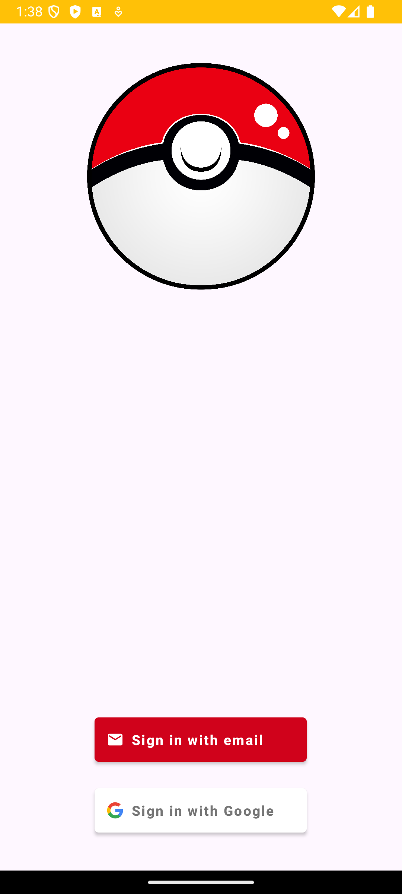
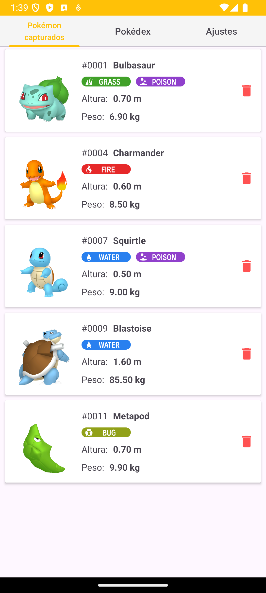
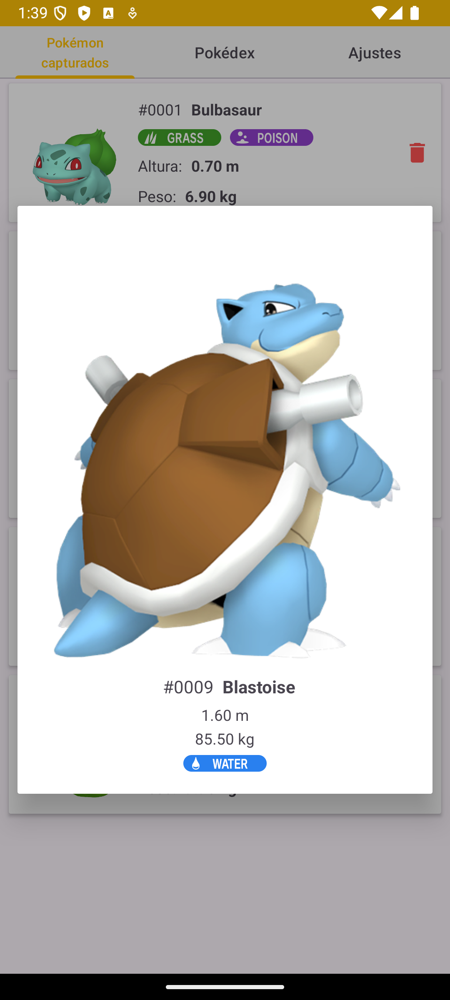
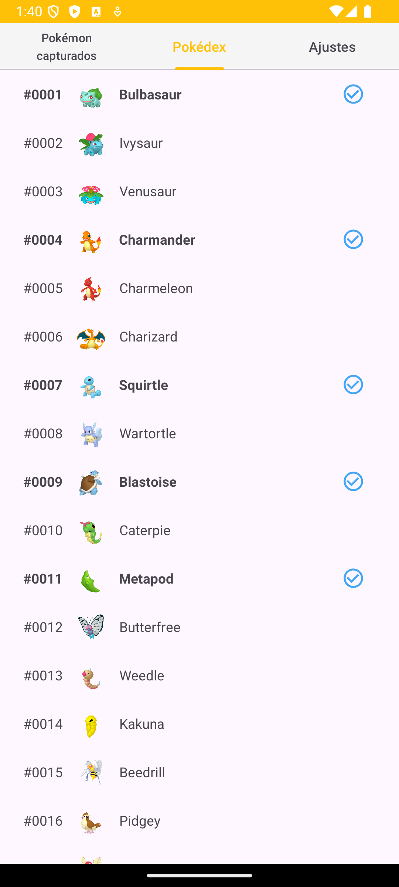
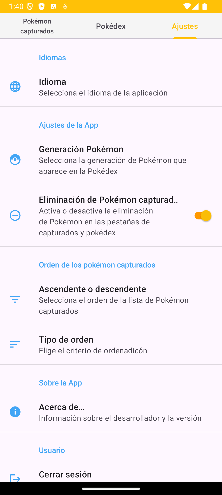

# Pokémon Manager App

## Introducción

**Pokémon Manager App** es una aplicación móvil diseñada para entrenadores Pokémon. Permite a los usuarios crear y gestionar una lista personalizada de Pokémon capturados, acceder a la Pokédex oficial, y configurar preferencias mediante una experiencia fluida y atractiva. La autenticación de usuarios y almacenamiento de datos se realiza a través de Firebase, y la Pokédex utiliza datos obtenidos directamente de la API oficial de Pokémon.

---

## Características Principales

- **Autenticación de Usuarios:** Inicio de sesión y registro mediante Firebase Authentication, incluyendo soporte para autenticación con Google.
- **Pokédex Completa:** Accede a una lista inicial de 150 Pokémon obtenidos de la API de Pokémon. Resalta los Pokémon capturados y permite seleccionarlos para agregarlos a tu lista personal.
- **Gestión de Pokémon Capturados:** Visualiza y administra los Pokémon capturados con datos detallados como tipo(s), peso y altura. Elimina Pokémon si la opción está habilitada en los ajustes.
- **Ajustes Personalizables:** Cambia el idioma entre castellano e inglés, habilita o deshabilita la opción para eliminar Pokémon, y cierra sesión.
- **Estilo Visual Atractivo:** Diseño inspirado en el universo Pokémon, con colores vibrantes y llamativos.
- **Responsive UI:** La interfaz se adapta a diferentes tamaños de pantalla para garantizar una experiencia óptima.

---

## Tecnologías Utilizadas

- **Librerías y Frameworks:**
  - **Firebase Authentication:** Gestión de usuarios.
  - **Firebase Firestore:** Almacenamiento de datos de los Pokémon capturados.
  - **Retrofit:** Consumo de la API de Pokémon.
  - **RecyclerView y CardView:** Visualización interactiva de listas.
  - **SharedPreferences:** Almacenamiento de configuraciones locales.

- **Lenguaje:** Java/Kotlin.  
- **API Externa:** [PokéAPI](https://pokeapi.co/) para datos de la Pokédex.  
- **Diseño:** Temas personalizados con colores Pokémon.  

---

## Instrucciones de Uso

# Instrucciones para Ejecutar el Proyecto

# Instrucciones para Ejecutar el Proyecto

## 1. Clonar el Repositorio
Clona el repositorio en tu máquina local ejecutando el siguiente comando en la terminal:
```bash
git clone https://github.com/tu_usuario/pokemon-manager-app.git
cd pokemon-manager-app
```

## 2. Configurar Firebase
- Accede a la [consola de Firebase](https://console.firebase.google.com/) y configura un nuevo proyecto si aún no tienes uno.
- Descarga el archivo `google-services.json` desde la configuración de tu proyecto Firebase.
- Coloca el archivo en el directorio `app/` del proyecto para permitir la integración con Firebase.

## 3. Instalar Dependencias
- Asegúrate de tener instalado Android Studio con el SDK de Android y Gradle configurado.
- Abre el proyecto en Android Studio y sincroniza las dependencias seleccionando la opción **"Sync Project with Gradle Files"** en la parte superior de la ventana.

## 4. Ejecutar la Aplicación
- Conecta un dispositivo Android físico con modo de desarrollador habilitado, o configura un emulador Android.
- En Android Studio, selecciona el dispositivo desde el menú desplegable de dispositivos disponibles.
- Haz clic en el botón **"Run"** (o presiona `Shift + F10`) para compilar y ejecutar la aplicación.

## 5. Probar la Aplicación
- Regístrate o inicia sesión con Firebase Authentication.
- Explora las pestañas de la aplicación (Pokédex, Pokémon Capturados y Ajustes) y utiliza sus funcionalidades.

---

## Notas Adicionales
- Asegúrate de que tu archivo `google-services.json` esté correctamente configurado, ya que es esencial para la autenticación y el almacenamiento de datos.
- Si encuentras errores de dependencias, verifica que tengas las versiones compatibles de las bibliotecas mencionadas en el archivo `build.gradle`.
- Consulta la documentación oficial de [Firebase](https://firebase.google.com/docs) o [Android](https://developer.android.com/docs) si necesitas más ayuda.
---

## Conclusiones del Desarrollador

El desarrollo de Pokémon Manager App ha sido un desafío enriquecedor. La integración de Firebase y Retrofit proporcionó una base sólida para la funcionalidad, mientras que el diseño de una experiencia de usuario intuitiva destacó como prioridad. Trabajar con API externas y el manejo de datos en tiempo real con Firestore ofrecieron aprendizajes clave sobre el diseño modular y eficiente de aplicaciones móviles.

## Capturas de pantalla

### Pantalla de Inicio


### Pantalla de Pokémons capturados


### Pantalla de los detalles del Pokémon


### Pantalla de Pokédex


### Pantalla de Ajustes

